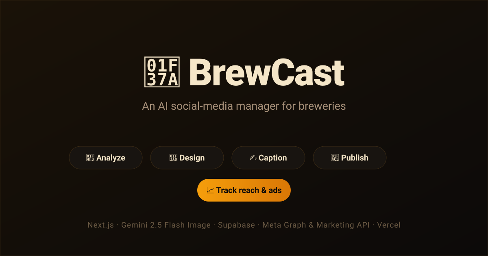

<div align="center">

# 🍺 BrewCast

### Give it a brewery's photos. It designs on-brand social posts, writes the captions, schedules and publishes them to Instagram & Facebook, then tracks both organic and paid performance — an AI social-media manager, end to end.

[](https://nextjs.org)
[](https://react.dev)
[](https://www.typescriptlang.org)
[](https://tailwindcss.com)
[](https://ai.google.dev)
[](https://supabase.com)
[](https://vercel.com)

**[Live demo →](https://brewcast-three.vercel.app/)** &nbsp;·&nbsp; an AI social-media studio for breweries, built end-to-end (no Canva, no Buffer, no low-code).

</div>

---



<!-- Tip: replace docs/screenshot.svg above with a real app screenshot (docs/screenshot.png) for extra portfolio polish. -->


## What it does

From a folder of raw brewery photos, BrewCast runs the full social-media pipeline — each step automated, each post on-brand:

1. **📸 Analyzes** the photos — a vision model scores them and reads mood, subjects, and composition
2. **🎨 Designs the post** — Gemini 2.5 Flash Image composes a finished, branded graphic (layout, legible headline text, the brewery's real logo) — not a filtered photo
3. **✍️ Writes the copy** — platform-tailored captions, headlines, and hashtags in the brewery's voice
4. **🗂️ Drafts for review** — every post lands in a review queue you can edit, approve, or reshoot
5. **📅 Schedules & publishes** — a durable job queue posts to Instagram & Facebook at the right time
6. **📈 Tracks organic reach** — pulls per-post insights (reach, engagement, saves) from the Instagram Graph API
7. **💸 Tracks paid ads** — live spend / CTR / CPC / ROAS from the Meta Marketing API

There's also a **chat console** — an agentic interface that can run any of the above conversationally.

## Engineering highlights

- **Generative-first design pipeline with graceful fallback** — every post tries `generative (Gemini 2.5 Flash Image) → deterministic AI Design Director → legacy templated compositor`. Each stage degrades to the next on failure, so a request **never errors out** and always returns a usable image.
- **Deterministic text rendering** — headlines are drawn from glyph geometry with `sharp` + `opentype.js`, so on-image copy is never hallucinated or misspelled, even when the layout is AI-driven.
- **Multi-tenant by design** — Supabase auth + an allowlist, with **per-brewery API keys and Meta credentials**, so the app can be demoed to multiple breweries from isolated accounts.
- **Cost-aware LLM fallback chain** — captions / headlines / vision try **Gemini → Groq → Mistral**, failing over on quota or schema errors so one exhausted tier never breaks a generation.
- **Every token metered** — an `ai_usage` ledger records cost per call against a prepaid budget, surfaced as a live spend meter on the admin page.
- **Queue-backed publishing** — `pg-boss` drives scheduled posts through a cron-triggered processor that runs without a user session.
- **Organic + paid analytics** — Instagram Graph insights for reach/engagement and the Meta Marketing API for live campaign performance, each on its own dashboard.

## Stack

| Layer             | Implementation                                                       |
| ----------------- | ------------------------------------------------------------------- |
| Frontend          | **Next.js 14 (App Router) + React 18**, Tailwind, Recharts          |
| Backend           | **Next.js Route Handlers** (serverless on Vercel)                   |
| Design (image)    | **Gemini 2.5 Flash Image** → deterministic `sharp`/`opentype.js` renderer |
| Copy & vision     | **Gemini 2.5 Pro/Flash → Groq → Mistral** fallback chain            |
| Photo enhancement | **Claid.ai** (non-generative HDR / upscale)                         |
| Queue             | **pg-boss** (scheduled publishing)                                  |
| Publishing        | **Instagram Graph API** (Instagram + Facebook)                      |
| Ad tracking       | **Meta Marketing API**                                              |
| Auth / DB / Storage | **Supabase** (Postgres + Auth + Storage)                          |
| Hosting           | **Vercel** (auto-deploy from `main`)                                |

## Architecture

```
app/ (Next.js App Router)
  ├─ /upload  /drafts  /chat  /analytics  /ads  /settings  /admin
  └─ /api/* (Route Handlers)
        └─ /api/upload/design ── generative → Design Director → legacy
              ├─ lib/ai/nano-banana.ts      (Gemini 2.5 Flash Image — full design)
              ├─ lib/design-director/*       (AI layout plan → deterministic render)
              ├─ lib/ai/{captions,headline,photo-analysis}.ts  (Gemini→Groq→Mistral)
              └─ lib/ai/usage.ts             (per-call cost ledger)
        ├─ /api/queue/process  ── pg-boss → lib/publish.ts → Instagram Graph API
        ├─ /api/analytics      ── lib/analytics.ts  (organic insights)
        └─ /api/ads            ── lib/ads.ts        (Meta Marketing API)
```

## Quick start

```bash
git clone https://github.com/brewcast-dev/brewcast.git
cd brewcast
npm install
cp .env.local.example .env.local   # Windows: copy .env.local.example .env.local
npm run dev                        # http://localhost:3000
```

Then run the SQL migrations in [`supabase/migrations/`](supabase/migrations) against your Supabase project (in order), and fill in credentials at **/settings** (or via `.env.local`).

### Getting keys

- **Gemini:** https://aistudio.google.com/apikey → `GOOGLE_GENERATIVE_AI_API_KEY` (billing-linked for the image model)
- **Supabase:** create a project → `SUPABASE_URL`, `SUPABASE_SERVICE_ROLE_KEY`; run the migrations in `supabase/migrations/`
- **Meta (publishing):** a Facebook Page + Instagram Business account → `META_IG_USER_ID`, `META_ACCESS_TOKEN`
- **Meta (ad tracking):** a Facebook-app token with the `ads_read` scope + ad account → `META_AD_ACCOUNT_ID`, `META_ADS_TOKEN`
- **Claid (optional):** https://app.claid.ai → `CLAID_API_KEY` (photo enhancement; no-ops without it)

## Deployment

Deployed on **[Vercel](https://vercel.com)** with auto-deploy from `main` — the Next.js Route Handlers run as serverless functions and a Vercel Cron hits `/api/queue/process` to publish scheduled posts.

1. Import the repo into Vercel → it detects Next.js automatically
2. Set the env vars (Gemini, Supabase service role, Meta credentials) in the project settings
3. Run each file in `supabase/migrations/` in the hosted Supabase SQL editor (migrations are applied manually, in order)

## API

| Method | Route                          | Description                                       |
| ------ | ------------------------------ | ------------------------------------------------- |
| `POST` | `/api/upload/design`           | Photo → finished, branded post (generative + fallbacks) |
| `POST` | `/api/ai/generate-caption`     | Platform-tailored caption + hashtags              |
| `POST` | `/api/queue/process`           | Cron-triggered publisher for scheduled posts      |
| `GET`  | `/api/analytics?days=`         | Organic reach / engagement dashboard data         |
| `GET`  | `/api/ads?days=`               | Live paid-campaign performance (Meta Marketing API) |
| `GET`  | `/api/usage`                   | AI spend vs. prepaid budget                        |

---

<div align="center">
<sub>An AI social-media manager for breweries — from raw photo to published, measured post.</sub>
</div>
